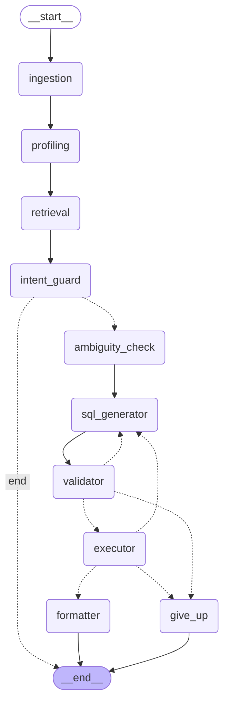

# SQL Agent — Ask Your Data

An agentic system that lets you upload any CSV and ask questions about it in plain English. It writes and runs real SQL against your data, explains the answer, shows the result as a table, and charts it when a chart actually helps — all through a LangGraph pipeline built specifically around the real failure modes of text-to-SQL, not just a wrapper around an LLM.

**Live demo:** [[Link](https://sql-multi-agent.streamlit.app/)]

## The problem this actually solves

Plain LLM text-to-SQL fails in three specific, well-understood ways. This project exists to catch each one before it reaches the user, not to avoid them by luck.

1. **LLMs hallucinate schema.** Ask a question, get SQL referencing a column that doesn't exist — especially likely when CSV headers are messy (`st_gdp_23` instead of `state_gdp_2023`).
   → Solved with column profiling (dtype, sample values, null %) fed to the model at generation time, and a validator that rejects any SQL referencing an unknown table or qualified column before it ever touches the database.

2. **LLMs generate confidently wrong or unsafe SQL.** Wrong joins, wrong aggregation logic, or — worse — a destructive statement.
   → Solved with a keyword-based intent guard that refuses delete/update/insert-style requests before any LLM call happens at all, plus a SQL validator enforcing SELECT-only, plus a self-correction loop that retries using the real database error when execution still fails.

3. **User questions are often ambiguous**, and a naive agent just guesses an interpretation and answers confidently. "Which state is doing best?" — best by what measure?
   → Solved with an ambiguity-check node and a real human-in-the-loop pause: the graph stops, asks a clarifying question, and resumes from exactly that point once answered (via LangGraph's `interrupt()` + a checkpointer).

## Architecture



Dotted lines are conditional edges — the graph's actual runtime decisions (retry vs. proceed vs. give up, refuse vs. continue).

**Pipeline, step by step:**

| Node | What it does |
|---|---|
| `ingestion` | Loads uploaded CSV(s) into DuckDB with automatic schema inference. Reuses an already-loaded table if the same file is queried again, instead of re-ingesting. |
| `profiling` | Builds a "column card" per column — dtype, sample values, null %, cardinality — so the model has enough context to interpret poorly-named columns. |
| `retrieval` | Embeds column cards and the question with FAISS, retrieves only the relevant columns instead of dumping the full schema into every prompt. |
| `intent_guard` | Deterministic keyword check for write-intent language (delete/update/insert/etc). Refuses immediately — no LLM call at all — if triggered. |
| `ambiguity_check` | Asks the LLM whether the question is answerable unambiguously given the retrieved columns. If not, pauses the graph (`interrupt()`) and asks the user to clarify. |
| `sql_generator` | Writes DuckDB SQL constrained to the retrieved schema. On retry, includes the previous error so it can self-correct. |
| `validator` | Rejects non-SELECT statements, references to unknown tables, and references to unknown qualified columns — before execution. |
| `executor` | Runs the validated SQL against a read-only connection, captures results or the real DB error. |
| `formatter` | Turns the result into a plain-language answer, and asks the LLM to decide whether/how to chart it (bar, scatter, line, or none) based on the question and result shape. |
| `give_up` | Reached if the retry limit is hit — returns a clear failure message instead of looping forever. |

## Tech stack

- **Orchestration:** LangGraph (including `interrupt()` + `MemorySaver` checkpointer for real human-in-the-loop)
- **LLM:** Groq (`ChatGroq` via LangChain) as primary, OpenRouter (OpenAI-compatible SDK) as automatic fallback
- **Data engine:** DuckDB — chosen over Postgres specifically for this use case: automatic CSV schema inference, zero server setup, fits a small, session-scoped, ephemeral dataset
- **Retrieval:** FAISS + `sentence-transformers` — in-process, no server, appropriate for a per-session corpus this small
- **Validation:** `sqlparse`
- **Frontend:** Streamlit, deployed on Streamlit Community Cloud
- **Charting:** Plotly
- **Observability:** LangSmith — traces every node execution in the graph, including retry loops and the interrupt/resume cycle, with per-step latency and token usage

## Observability

Every node execution is traced through LangSmith — you can see exactly which node ran, how long each step took, how many retry attempts a query needed, and the full prompt/response for every LLM call, including the ambiguity-check pause and resume. This turned out to be the fastest way to actually debug the retry loop and the interrupt/resume flow during development, rather than only relying on print statements or the "SQL used" expander in the UI.

## Setup

```bash
git clone https://github.com/bhardwaj-ayush03/SQL-Agent
cd sql-agent
pip install -r requirements.txt
```

Create a `.env` file in the project root:
```
GROQ_API_KEY=your_groq_key_here
OPENROUTER_API_KEY=your_openrouter_key_here
LANGCHAIN_TRACING_V2=true
LANGCHAIN_API_KEY=your_langsmith_key_here
LANGCHAIN_PROJECT=sql-agent
```

The LangSmith variables are optional — the app runs fine without them. When set, LangGraph automatically traces every node execution to your LangSmith project, including retry attempts and the interrupt/resume cycle, without any code changes.

Run it:
```bash
streamlit run frontend/streamlit_app.py
```

Upload a CSV and start asking questions.

## Example questions to try

- `Which state has the highest GDP?` — straightforward, no clarification needed
- `Which state is doing the best?` — ambiguous, should trigger a clarifying question
- `Which states have a GDP above the average GDP of all states?` — requires a subquery
- `Delete the first row` — should be refused immediately, no query ever generated

## Known limitations

Being upfront about these rather than letting them surface as surprises:

- **`intent_guard` is a keyword match**, not intent understanding. A legitimate analytical question containing a word like "removed" (e.g. "which items are frequently removed from carts") would incorrectly trigger a refusal. This is a deliberate safety-over-convenience trade-off, not an oversight.
- **The validator doesn't check bare (unqualified) column names** — e.g. `SELECT gdp_billion FROM states` isn't checked against the real schema, only `table.column`-style references are, since telling a real column apart from an alias reliably needs a full SQL parser. Hallucinated bare columns are still caught, just one layer later, by the executor's real database error, which feeds the retry loop.
- **Chart type selection is LLM-driven and best-effort.** It generally picks a sensible chart type based on the question and result shape, but isn't guaranteed to always match what a user specifically wants, and there's no way to manually override the chart type yet.
- **No multi-CSV join support yet.** Each uploaded file is queryable independently; the agent doesn't currently reason across joins between separately uploaded files.
- **No persistent eval suite yet** — accuracy is currently demonstrated through manual testing, not a tracked golden-query benchmark.

## What I'd build next

- A small golden-query evaluation set (question → expected SQL/result) to get a real accuracy number instead of relying on manual testing
- Multi-CSV join support, letting the agent reason across related uploaded files
- A manual chart-type override in the UI

## Project structure

```
sql-agent/
├── app/
│   ├── config.py
│   ├── graph/
│   │   ├── state.py
│   │   ├── build_graph.py
│   │   └── nodes/
│   │       ├── ingestion.py
│   │       ├── profiling.py
│   │       ├── retrieval.py
│   │       ├── intent_guard.py
│   │       ├── ambiguity_check.py
│   │       ├── sql_generator.py
│   │       ├── validator.py
│   │       ├── executor.py
│   │       └── formatter.py
│   ├── llm/client.py
│   ├── db/duckdb_manager.py
│   └── embeddings/column_store.py
├── frontend/streamlit_app.py
├── data/sample_csvs/
├── requirements.txt
└── .env.example
```

## 🤝 Contributing

Pull requests are welcome. For major changes, open an issue first to discuss what you'd like to change.

---

## 👤 Author

**Ayush Bhardwaj**


[](https://github.com/bhardwaj-ayush03)
[](https://linkedin.com/in/ayushbhardwaj03)

